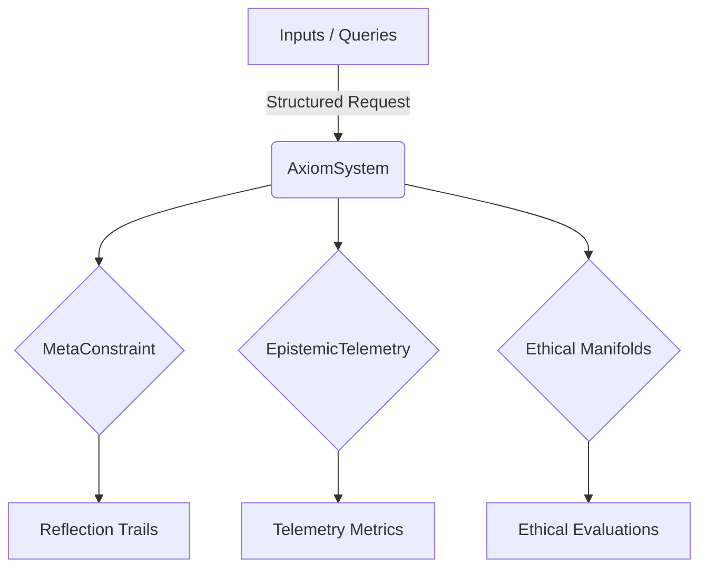

# AXIΩM Ontological Framework

The AXIΩM Ontological Framework encodes the architectural principles that govern
bounded, auditable AI systems. This documentation site outlines the domain
concepts, development standards, and operational lifecycle that underpin the
repository.

## Key Principles

- **Meta-constraint governance** — No architectural change may occur without a
  reflective report of the unknowns and risks introduced.
- **Epistemic telemetry** — Deterministic metrics track conscience latency,
  gradient decoherence, semantic viscosity, and coherence flux.
- **Ethical manifold evaluation** — Every action proposal is evaluated through
  Kantian, Hobbesian, and Utilitarian lenses.

## Getting Started

1. `make bootstrap`
2. `make check`
3. Review the [Developer Guide](developer-guide.md) for day-to-day workflows.

## Architecture Diagrams

